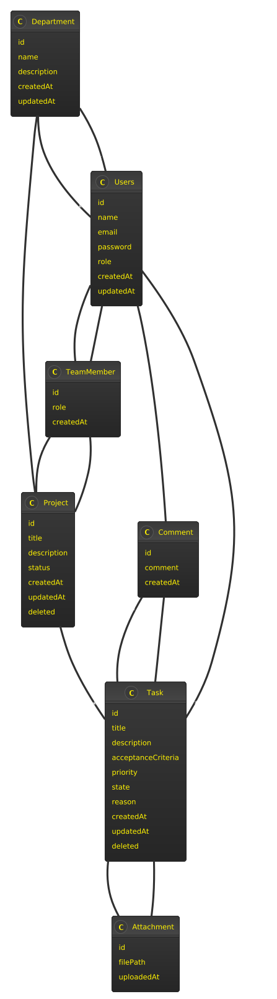

# Advanced Task Management System

## Introduction
The Advanced Task Management System is a comprehensive project built using **Java Spring Boot** and **PostgreSQL**. It is designed to facilitate efficient project and task management, supporting user roles, team collaborations, and department-based access control. This system includes authentication, authorization, and a secure API for seamless interaction with a frontend or external integrations.

## Features
- **User Authentication & Authorization** (JWT-based security)
- **Role Management** (Admin, Project Manager, Team Leader, Member)
- **Project Management** (CRUD operations on projects)
- **Task Management** (Task creation, assignment, tracking)
- **Team Member Association** (Users assigned to projects with different roles)
- **Department-Based Organization** (Users belong to departments, projects assigned to departments)
- **Comments & Attachments** (For collaboration on tasks)
- **Swagger API Documentation** (For easy API testing)

## Technologies Used
- **Backend**: Java Spring Boot
- **Database**: PostgreSQL
- **Security**: Spring Security, JWT
- **API Documentation**: Swagger (Springdoc OpenAPI)
- **Build Tool**: Maven

## Database Schema (Simplified UML Representation)

### Tables:
- **Users**: Stores user details and roles
- **Department**: Represents different organizational departments
- **Project**: Projects under specific departments
- **TeamMember**: Links users to projects with assigned roles
- **Task**: Tasks related to projects
- **Comment**: User comments on tasks
- **Attachment**: File attachments for tasks

## Installation & Setup
### Prerequisites
- Java 21+
- PostgreSQL installed and running
- Maven installed

### Setup Steps
1. Clone the repository:
   ```sh
   git clone https://github.com/your-repo/task-management.git
   cd task-management
   ```
2. Configure `application.properties` (or `application.yml`):
   ```properties
   spring.datasource.url=jdbc:postgresql://localhost:5432/taskdb
   spring.datasource.username=your_db_user
   spring.datasource.password=your_db_password
   spring.jpa.hibernate.ddl-auto=update
   jwt.secret=your_secret_key
   jwt.expiration=3600000
   ```
3. Build and Run:
   ```sh
   mvn clean install
   mvn spring-boot:run
   ```

## API Documentation
Once the application is running, you can access the Swagger UI at:
```
http://localhost:8080/swagger-ui/index.html
```

### Authentication & Authorization
- **Login**: `POST /api/auth/login` → Returns JWT token
- **Use Token**: Add the token in the `Authorization` header in Swagger UI
  ```
  Authorization: Bearer your_token_here
  ```

### Key API Endpoints
- **Users**
  - `GET /api/users` - List all users
  - `POST /api/users` - Create a new user
- **Projects**
  - `GET /api/projects` - List all projects
  - `POST /api/projects` - Create a new project
- **Tasks**
  - `GET /api/tasks` - List all tasks
  - `POST /api/tasks` - Create a new task
- **Comments & Attachments**
  - `POST /api/comments` - Add comments to tasks
  - `POST /api/attachments` - Upload file attachments

## Troubleshooting
### Swagger UI not loading?
- Ensure the `springdoc-openapi` dependency is included.
- Check `http://localhost:8080/v3/api-docs` returns JSON.

### Cannot resolve column 'department_id'?
- Ensure the database is correctly migrated with Hibernate (`spring.jpa.hibernate.ddl-auto=update`).

### JWT Authentication Issues?
- Ensure `jwt.secret` is properly configured in `application.properties`.
- Debug by logging the token decoding process.

## Future Enhancements
- Email notifications for task updates
- WebSocket-based real-time updates
- Improved UI with a frontend framework (React or Angular)
- Role-based dashboards

## Contributing
1. Fork the repository
2. Create a feature branch (`git checkout -b feature-xyz`)
3. Commit your changes (`git commit -m "Add new feature"`)
4. Push to the branch (`git push origin feature-xyz`)
5. Open a pull request


 ## UML Diyagramı
 
 
 
## License
This project is licensed under the MIT License.
